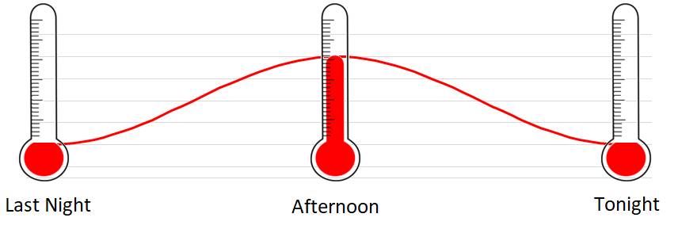
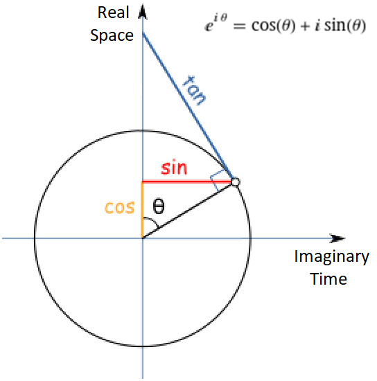

# Clockwise Trigonometry

## Clockwise

Clocks tick clockwise. Screws, bottle tops, jar lids, all tighten when you rotate them in the clockwise direction.

## Axis

Time is usually left to right. Left represents the past. Right represents the future.

People usually understand the up and down axis as movement in space. Higher or lower, above or below.

We talk about sound volume or temperature in terms of being "high" and "low". Here's a quick visual that should feel intuitive:

## Trigonometry

In standard mathematics, rotations start at the right of the circle, and go counterclockwise. If the horizontal axis is time, then the rotation makes it look like we are going back in time..

Let's see if we can update the definitions in trigonometry, and make it more consistent with everything else in life.

If left means past, middle means present, and right means future, then it makes sense to "start" in the middle at present. Clockwise rotations means you are going into the future. Counterclockwise rotations means you are going into the past.

## Consequences

The simple change in definition of rotation and start position, does not really change trigonomic formulas. Rather, it changes one's perspective of sine, cosine, and imaginary numbers.

