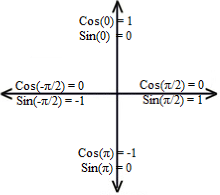
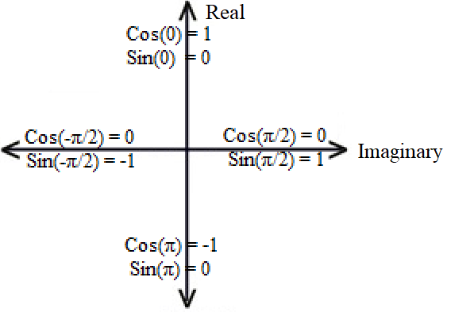
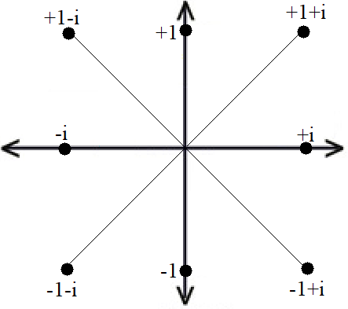

# Clockwise Trigonometry

## Clockwise

Clocks tick clockwise. Screws, bottle tops, jar lids, all tighten when you rotate them in the clockwise direction.

## Axis

Time is usually left to right. Left represents the past. Right represents the future.

People usually understand the up and down axis as movement in space. Higher or lower, above or below.

We talk about sound volume or temperature in terms of being "high" and "low". Here's a quick visual that should feel intuitive:

## Trigonometry

In standard mathematics, rotations start at the right of the circle, and go counterclockwise. If the horizontal axis is time, then the rotation makes it look like we are going back in time..

Let's see if we can update the definitions in trigonometry, and make it more consistent with everything else in life.

If left means past, middle means present, and right means future, then it makes sense to "start" in the middle at present. Clockwise rotations means you are going into the future. Counterclockwise rotations means you are going into the past.

How to redefine trigonometric rotation in the way? Let's take a look at what we can do.

First, from the context of a triangle, we want to make sure to keep sine and cosine the same.

How can we change the definition of a circle rotation without changing the definitions of triangle?

At angle = 0, we want the point to be at the top. 

Cos(0) = 1, Sin(0) = 0.

After a forth of a rotation, we want the point to be to the right:

Cos(π / 2) = 0, Sin(π / 2) = 1.

In standard trigonometry, we define the cosine to represent the horizontal axis, and the sine to represent the vertical axis.

Yet, if we were to say that cosine represents the vertical axis, and sine represents the horizontal axis, then we can get away with the zero degree to start on the top, and rotation to be clockwise.

## Complex plane

If we are going to change the positions of sine and cosine, then we will have to deal with the position of imaginary numbers.

As a recap:

eiθ = cos(θ) + i * sin(θ)

If you want to plot a complex number of a graph, then the real cosine gets plotted on one axis, and the imaginary sine gets plotted on the other axis.

Real numbers need to be on the same axis as cosine.

Imaginary numbers need to be on the same axis as sine.

Traditionally, Real numbers are on the horizontal, and Imaginary numbers are on the vertical.

Since we are changing the axis of cosine and sine, then we'd need to change the axis of real and imaginary numbers.

## Consequences

The simple change in definition of rotation and start position, does not really change trigonomic formulas. Rather, it changes one's perspective of sine, cosine, and imaginary numbers.

Just to be clear, all of the trig formulas stay exactly the same. All we are doing is redefining which axis is real and which axis is imaginary.

Complex numbers and their conjugates are now left and right:

Note that all of our usual graphs stay the same.. 

