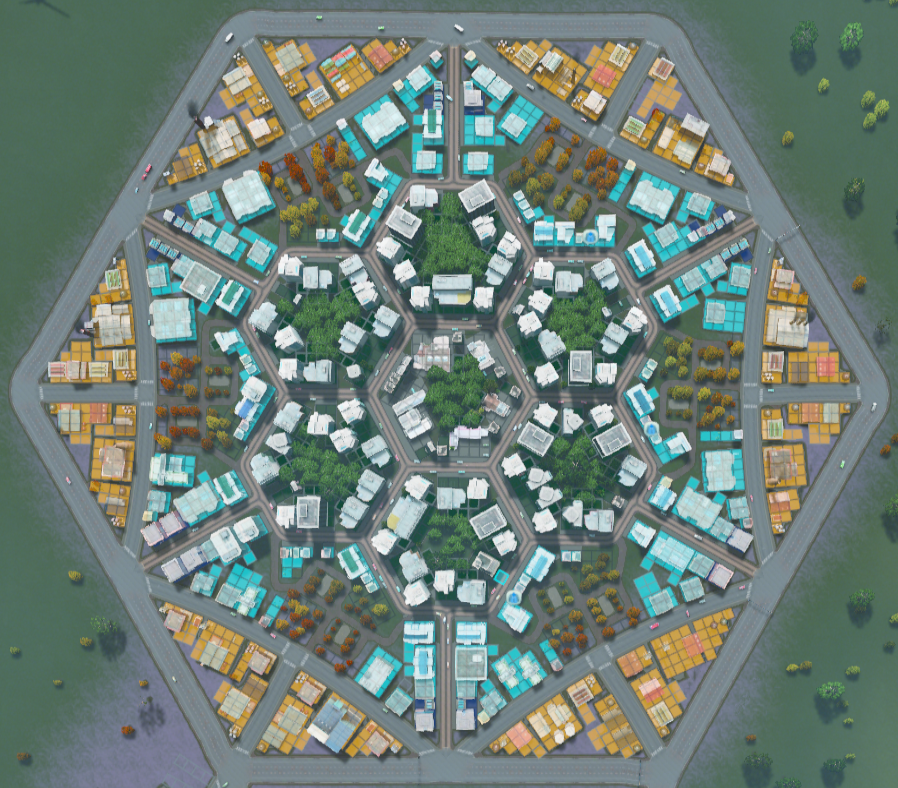

# Hexagon Road Layout

Ideally with road design, we'd want to minimize the amount of road, and maximize the amount of area that the road gets us to.

A honeycomb hexagonal design maximizes the area, and minimizes the perimeter. Doing this should lower the amount of roads we require, and hence minize road cost.

A purely hexagonal road tilling means that only 3 roads join at an intersection (instead of a usual four way intersection with square grid), which would increase the safety of the road.

I've experimented with the idea in the game Cities Skylines.

Cities Skyline is a game that allows us to build roads with Residential, Commercial, Industrial, and Office zones.

Residential zones prefer a quiet, pollution free area. But they need to be able to work somewhere.

Industrial zones are sources of jobs for many people, but create pollution, and need to be close to the highway for fast product transport.

It's best for industrial zones to be within walking distance to residents, but not too close that they cause polution in the neighborhood.

Although this is not a perfect model, I think this is a relatively good analogy for the real world.

I've hence adapted my hexagonal design ideas to Cities Skylines, and built what I feel is one of the most efficient uses of land.

This design is like a self sustaining *modular* neighborhood. You can place multiple of such neighborhoods right next to eachother.

They are able to sustain themselves with minimal outside needs.

